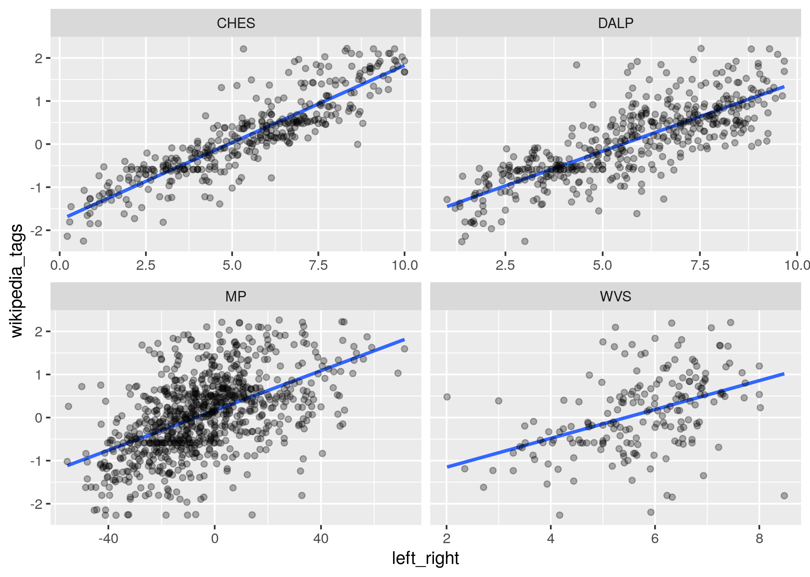

# Party positions from Wikipedia classifications

Herrmann, Michael, and Holger Döring. 2021. “Party Positions from Wikipedia Classifications of Party Ideology.” Political Analysis 31(1): 22–41. — doi: [10.1017/pan.2021.28](https://doi.org/10.1017/pan.2021.28)

Holger Döring, and Michael Herrmann. 2022. “Party Positions from Wikipedia Tags (July 2022).” — doi: [10.5281/zenodo.7043511](https://doi.org/10.5281/zenodo.7043511)

+ Holger Döring — holger.doering@gesis.org
+ Michael Herrmann — michael.herrmann@uni-konstanz.de

Results

+ party positions and tags in [party-position-tags.csv](04-data-final/party-position-tags.csv)
+ tag positions in [tag-position.csv](04-data-final/tag-position.csv)
+ visualization of [parties by country](06-figures-tables/fig-countries.pdf) and [tags](06-figures-tables/fig-tags-scaled.pdf)

---

## Install

Running all scripts requires R, Python and Stan.

We use [Docker](https://docs.docker.com/get-docker/) as a replication environment. It includes R, RStudio, Python, Stan and all packages (see [Dockerfile](Dockerfile)).

```sh
docker-compose up -d  # start container in detached mode

docker-compose down   # shut down container
```

<http://localhost:8787/> — RStudio in a browser with all dependencies

## Project structure

__Note__ — Using [RStudio project](https://support.rstudio.com/hc/en-us/articles/200526207-Using-Projects) workflow – _0-wp-data.Rproj_. All R scripts use project root as base path and file paths are based on it.

+ [z-run-all.R](z-run-all.R) — stepwise execution all scripts (R and Python)
+ [data-files-docs.csv](data-files-docs.csv) — documentation all datasets (path, type, description)

### Folders

+ __01-data-sources__
  + _01-partyfacts_ — Party Facts data
  + _02-wikipedia_ — Wikipedia data and infobox tags
  + _03-party-positions_ — party position data for validation (CHES, DALP, Manifesto, WVS)
+ __02-data-preparation__ — create datasets for analysis
+ __03-estimation__ — estimation of models and post-estimation
+ __04-data-final__ — datasets with party and tags positions (only M2)
+ __05-validation__ — validation of party positions (only M2)
+ __06-figures-tables__ — visualization of results (only M2)

### Tag harmonization

A dataset of Wikipedia tags is created in _02-data-preparation/01-wp-infobox.R_.

+ some minor harmonization of category names
+ selects only categories that are used _twice_

The dataset used for the analysis is created in _02-data-preparation/02-wp-data.R_.

+ filter most frequent tags — _see parameter_
+ create dataset in wide format with tags as variable names

## Estimation

Model 2 (and Model 1) can be estimated in _03-estimation_.

We use only Model 2 for post-estimation and the succeeding preparation of final data, figures and tables.

### Party positions

We include party position data for validation — see _01-data-sources/03-party-positions/_

+ Chapel Hill Expert Survey ([CHES](https://www.chesdata.eu/)) – trend file 1999–2019
+ Democratic Accountability and Linkages Project ([DALP](https://sites.duke.edu/democracylinkage/)) expert survey (Kitschelt 2013)
+ Manifesto Project ([MP](https://manifesto-project.wzb.eu/)) – left-right (rile) scores
+ World Values Survey ([WVS](http://www.worldvaluessurvey.org)) — voters left-right self-placement, Wave 6, 2010–2014

---

## Changes

Differences of revised code with paper-based code used in replication material:

Herrmann, Michael, and Holger Döring. 2021. “Replication Data for: Party Positions from Wikipedia Classifications of Party Ideology.” — doi: [10.7910/DVN/1JHZIU](https://doi.org/10.7910/DVN/1JHZIU)

### Data

+ new (revised) main final dataset — _04-descriptives/party-tags-positions.csv_
+ remove _historical_ and _faction_ tags sections

### Code

+ [Stan](https://mc-stan.org/) statistical computing platform used for estimation (JAGS  deprecated)
+ new folder structure with index numbers
+ fewer R packages dependencies
+ focus on Model 2 (Model 1 estimation only)
+ removed tables and figures only relevant for paper
+ revised documentation all scripts

---


